  <picture>
    <source media="(prefers-color-scheme: dark)" srcset="logo.png">
    <source media="(prefers-color-scheme: light)" srcset="logo.png">
  </picture>

<h1 align="center" style="color:#00ff88; font-family:monospace; font-weight:bold;">VMDB // The AIOps Platform for Cloud-Native Operations</h1>

  <a href="#-what-is-vmdbio"><strong>What is VMDB.io?</strong></a> •
  <a href="#-core-ops-capabilities"><strong>Core Ops Capabilities</strong></a> •
  <a href="#-architecture"><strong>Architecture</strong></a> •
  <a href="#-getting-started"><strong>Getting Started</strong></a> •
  <a href="#-contributing"><strong>Contributing</strong></a>

  
  
  
  

---

### ► What is VMDB.io?

**VMDB.io** is an active, real-time, event-driven AIOps platform designed for the complexity of modern cloud-native environments. It serves as the central nervous system for your cloud architecture, unifying configuration, automation, and operational intelligence into a single, cohesive system.

Built to solve the challenges of distributed systems, VMDB provides a versioned, auditable, and queryable single source of truth for all operational data. It enables hyperautomation workflows, predictive analytics, and real-time control, empowering Platform and SRE teams to build resilient, efficient, and scalable infrastructure.

---

### ► Core Ops Capabilities

VMDB is built on a set of powerful, composable `Ops` primitives. Each primitive addresses a specific operational domain, but together they form a comprehensive platform for intelligent automation.

| Primitive | Description | Use Case / Supported Functionality |
| :--- | :--- | :--- |
| <code style="color:#00ff88;">Ops Vertex</code> | The foundational, atomic unit of configuration. It's an intelligent, namespaced, and versioned key-value record with built-in schema validation. | Ensures consistent, validated, and auditable configuration management with complete state history and recovery capabilities. |
| <code style="color:#00ff88;">Ops Flags</code> | Real-time operational toggles controlled by Ops teams to manage system health and performance without code redeploys. | Manages traffic/load control, enables graceful degradation during outages, and serves as an emergency kill switch to maintain system stability. |
| <code style="color:#00ff88;">Ops Prompts</code> | Parameterized prompt templates designed for AI agents and human operators to guide decision-making and standardize interactions. | Powers AI-assisted decision-making, ChatOps, and guided operator workflows, ensuring consistent and context-aware responses. |
| <code style="color:#00ff88;">Ops Rules</code> | A declarative engine for defining conditional logic and automation workflows that are triggered by system events or `Ops Prompts`. | Enables complex policy enforcement, conditional workflows, and automated responses to operational events. |
| <code style="color:#00ff88;">Ops Actions</code> | The execution engine for event-driven operations. `Ops Actions` are triggered by `Ops Rules` to perform tasks in external systems. | Orchestrates automated remediation, resource provisioning, and incident response workflows across your entire toolchain. |
| <code style="color:#00ff88;">Ops Fluents</code> | Dynamic lookups and scheduled data importers that keep VMDB's configuration state synchronized with external sources of truth. | Provides context enrichment by pulling data from other systems (e.g., cloud provider APIs, internal databases) into `Ops Vertex` records. |
| <code style="color:#00ff88;">Ops Credentials</code> | A secure, multi-tenant interface for managing secrets required for operational workflows and system integrations. | Securely manages secrets by integrating with external providers like HashiCorp Vault, acting as the control plane for access. |

---

### ► Architecture

VMDB's power stems from its unique **CQRS/ES (Command Query Responsibility Segregation / Event Sourcing)** architecture. Every change to the system is captured as an immutable event, creating a perfect, tamper-proof audit trail.

This design provides two key advantages:
1.  **Time-Travel Queries:** Instantly retrieve the exact state of any configuration at any point in history.
2.  **Hyper-Scalability:** Reads and writes are independently scaled, ensuring high performance for both data ingestion and complex queries.

```mermaid
graph LR
    subgraph "VMDB.io Platform"
        subgraph "Write Path"
            API[API/CLI/SDK] -- Command --> CommandHandler[Command Handler]
            CommandHandler -- Emits Event --> EventStore[(Event Store)]
        end
        subgraph "Read Path"
            EventStore -- Projects --> ReadModel[Read Model]
            QueryAPI[Query API] -- Query --> ReadModel
        end
    end

    style API fill:#1a1a1a,stroke:#00ff88,stroke-width:2px
    style QueryAPI fill:#1a1a1a,stroke:#00ff88,stroke-width:2px
    style CommandHandler fill:#1a1a1a,stroke:#00ff88,stroke-width:2px
    style EventStore fill:#00ff88,stroke:#000,color:#000
    style ReadModel fill:#1a1a1a,stroke:#00ff88,stroke-width:2px
```

---

### ► Getting Started

*Coming soon. Stay tuned for our CLI, SDKs, and Terraform Provider.*

---

### ► Contributing

We believe in the power of community-driven development. VMDB is built with and for the open-source community. We welcome all contributions, from documentation improvements to new feature proposals.

Please read our `CONTRIBUTING.md` for details on our code of conduct and the process for submitting pull requests.
