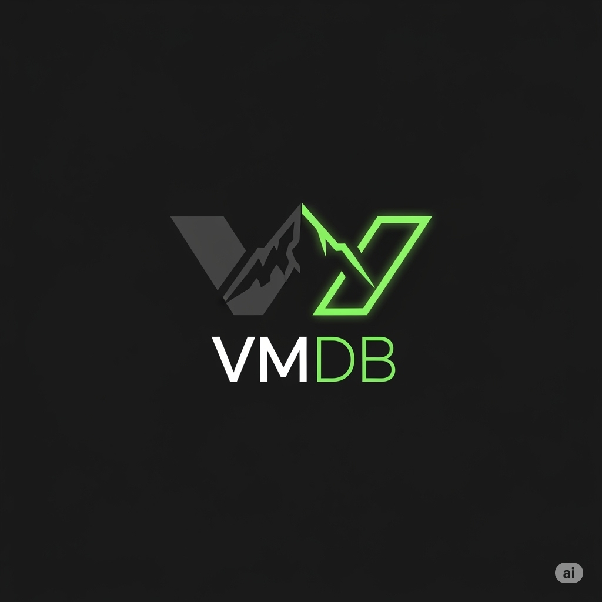

# VMDB.io: The Intelligent Developer Control Plane 🏔️✨

~

Welcome to the GitHub profile of **VMDB.io** – the **Vertex Management Database** – an **active, real-time, event-driven hub** designed to be the central nervous system for cloud-native architectures. We are evolving beyond passive, traditional CMDBs to become the **Intelligent Developer Control Plane** that provides context, governance, and automation across the entire software lifecycle, specifically engineered to solve the "AI Productivity Paradox".

Our brand identity features a black abstract geometric theme with sharp, clean lines, accented by **Neon Green (#00ff88)**. Our logo, a stylized, geometric 'V' representing a mountain peak and a vertex, embodies this ethos.

---

### What is VMDB.io?

VMDB.io is a next-generation unified platform for IT and AI operations management, integrating the full spectrum of configuration, automation, and intelligent operational controls into a single cloud-native SaaS solution. It delivers a **single pane of glass** for managing the complexity and dynamism of modern IT and AI infrastructures, enabling organizations to optimize operational efficiency, agility, and resilience in a cost-effective, scalable SaaS platform.

---

### Our Foundational Architecture: The Engine of Intelligence

At its core, VMDB.io is built on a **highly scalable, distributed graph database** that captures the entire state and history of your infrastructure, applications, and AI systems. This architecture enables:
*   **Immutable Audit Trail:** Provides a perfect, tamper-resistant record of every configuration change.
*   **"Time-Travel" Queries:** Allows you to understand the state of any service at any point in history.
*   **High Scalability:** Designed for massive scale for both reads and writes.

---

### Key Features & Capabilities

VMDB.io unifies and enhances existing configuration management tools by acting as a higher-level abstraction layer and intelligent orchestration platform. We provide crucial context, governance, and performance correlation that low-level primitives lack.

#### 1. **Unified Configuration Management**
*   **Ops Vertex:** Our foundational atomic configuration entity. These are **intelligent, versioned key-value pairs** with comprehensive **versioning and rollback support**. They include **schema definitions** and **built-in validations** for data quality and compliance.
*   **Boundaries:** Hierarchical namespaces for isolating configuration (e.g., `prod/api/us-east-1`) with scoped Role-Based Access Control (RBAC).
*   **Git-Native Sync:** Automatically syncs configuration from Git repositories, turning GitOps into an active, queryable state.
*   **Dynamic Configuration Refresh:** Supports dynamic configuration updates without application restarts, crucial for microservices and cloud-native applications.

#### 2. **Intelligent Operational Control with Ops Flags**
*   **Ops Flags:** Real-time operational toggles for managing system behavior, load, maintenance states, or mitigating outages dynamically without code redeployment. They are geared towards **operational control and real-time system health management**, distinct from traditional feature flags.
*   **Use Cases:** Temporarily disabling resource-intensive features during peak load, activating maintenance mode, safeguarding critical transactions, or acting as emergency kill switches.

#### 3. **Advanced AIOps & Automation**
*   **MCP Server (Multipoint Control Plane):** Positions VMDB as the **"memory" or "context" layer for AI-driven operations (AIOps)**. It provides dynamic contextual and operational capabilities to AI applications, enabling intelligent, secure, and extensible interactions with infrastructure and operational data. Features include context management, state persistence for conversation history, and integration with AI models for Retrieval-Augmented Generation (RAG).
*   **Real-time Topology and Dependency Mapping:** With AI-driven event correlation, anomaly detection, predictive analytics, and root cause analysis.
*   **AI-Driven IP Conflict Resolution & Subnet Planning:** Leveraging machine learning to optimize address space usage dynamically.
*   **Predictive Asset Lifecycle Analytics:** Forecasts asset lifecycle events (failures, renewals) for proactive management.
*   **AI-Enabled Incident Management:** Automated incident classification, prioritization, and resolution workflows that drastically reduce human intervention and speed incident response.
*   **Hyperautomation:** For end-to-end workflow automation, integrating automated remediation, provisioning via Infrastructure as Code, and continuous compliance enforcement.
*   **Ops Actions:** Triggered operations for remediation, provisioning, and system orchestration in response to events or rules.

#### 4. **Comprehensive Integration & Ecosystem**
VMDB.io is designed to integrate seamlessly across your cloud and development stack:
*   **Developer Tools:** Web App, API (Cloud and Edge), CLI, SDKs (NodeJS, GoLang, Rust, V), Terraform Provider, Ansible Module, and Kubernetes Operator. All these tools utilize a **distributed blackboard pattern** where the central configuration store is read/written by all components.
*   **Cloud Integrations:** Seamlessly integrates with major cloud providers' native configuration and secret services (e.g., Azure App Configuration, AWS Systems Manager, Google Config Connector, Oracle OCI Resource Manager, IBM Cloud Schematics, Tencent Cloud Configuration Center, Alibaba ACM).
*   **Secrets Management:** Our strategy is **integration and partnership, not competition**. We de-emphasize native secret storage and provide first-class, deep integrations with leading platforms like HashiCorp Vault, CyberArk, and Akeyless, adding contextual, application-aware governance through our policy engine.
*   **ITSM Integration:** Integrates with ITSM tools for automated ticketing and AI-based incident prioritization.

#### 5. **Data Integrity & Governance**
*   **Governors:** A declarative **"policy-as-code" engine** using simple YAML to enforce standards, data integrity, and compliance across all configurations.
*   **VMDB Primitives:** Specialized, optimized data types (e.g., `net.uri`, `id.uuid`, `blob.fixed[N]`, `toggle.semantic`, `toggle.percentage`) that add intelligence, validation, and performance directly into the platform's DNA. They ensure data integrity, optimize storage, and empower Governors with strict type enforcement.
*   **Ops Rules:** Declarative automation rules, triggered by Ops Prompts, enabling complex conditional workflows and policy enforcement.
*   **Ops Validations & Schema:** Built-in schema definitions and validation rules for Ops Vertices and complex config structures ensure data integrity and compliance at ingest and update time.

#### 6. **Security-First & Observability**
*   **Zero-Trust Access:** Encrypted storage, and integration with managed identity providers and key vaults ensuring secure configuration and secret management.
*   **BYOK (Bring Your Own Key) & BYOS (Bring Your Own Storage):** For encryption and data residency requirements.
*   **FinOps Dashboard:** For tenants to see their exact event usage, providing valuable cost attribution and potential savings metrics.
*   **Event Logging & Auditing:** Comprehensive auditing for all transactions and context changes.
*   **Customizable Dashboards & Reporting:** Consolidating telemetry from cloud, on-prem, and edge environments.

---

### Our Strategic Differentiator

VMDB.io's strategic position is not to be a point solution in a crowded market, but to serve as a **higher-level, intelligent control plane that unifies these disparate domains**. We operate a layer above, providing the crucial context, governance (Scorecards), and performance correlation that primitives lack. By integrating a software catalog, engineering scorecards, developer self-service, and release controls into a single platform, VMDB provides the context and governance necessary to manage the complexity of modern, AI-augmented software development.

We are built for **DevOps Engineers, SREs, and Platform Engineers** – a **developer-centric** platform focused on workflow efficiency, clarity, and information hierarchy.

---
